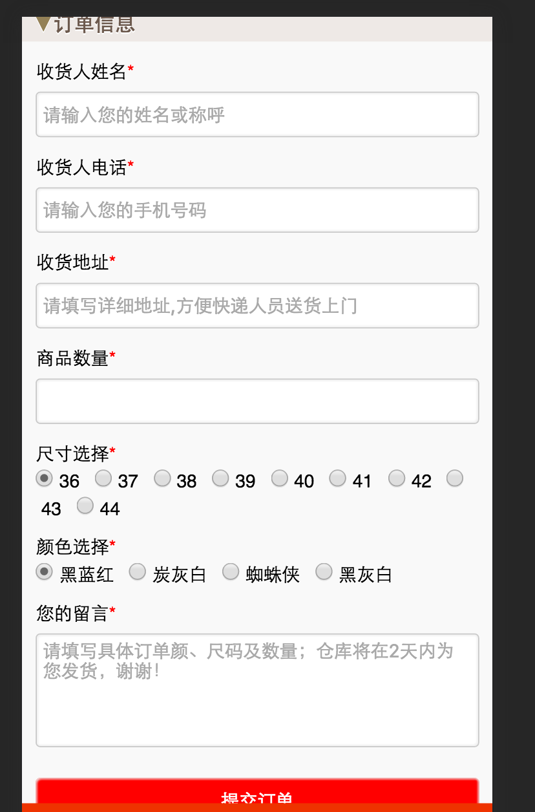
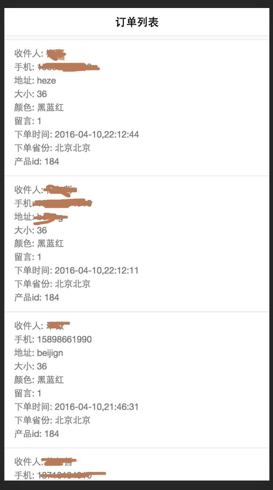
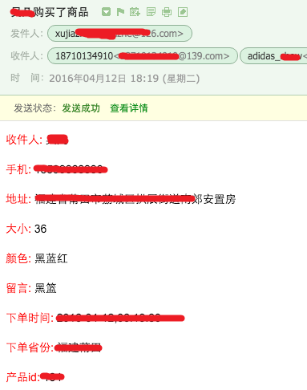

帮朋友做的, 两天的开发部署时间    

主要功能是卖一个产品  
对一个商品下订单,然后可以收到下订单的邮件,也可以在后台看到订单列表 (访问 /cwcq_jiayou)  

使用  
clone下来  
npm install  
#### install mongodb locally  
brew install mongodb
#### start mongodb with specified db path  
mongod --dbpath=~/PycharmProjects/sellGoods/database
mongo 进入mongo命令性界面  create db and collections named sellGoods in mongodb
rename my-settings.js to settings; 修改配置
npm start
做好dns配置,然后访问 adidas.****.com  
加上forever后台监控  

  
  
  
  
